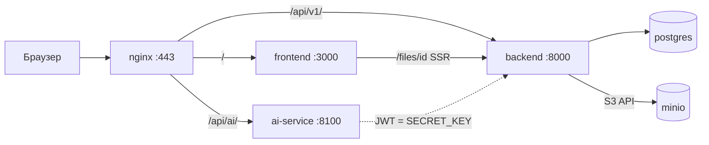

# ТестКит — runbook деплоя

Runbook деплоя. Образы `ghcr.io/ds-testkit/*` — multi-arch (`linux/amd64`, `linux/arm64`) из CI `frontend` / `backend` / `ai`.

## Архитектура



| Путь снаружи | Куда внутри |
|--------------|-------------|
| `/` | SvelteKit (`frontend`) |
| `/api/v1/` | FastAPI (`backend`) |
| `/api/ai/` | ai-service |
| `/files/{id}` | frontend → backend `/api/v1/tasks/files/{id}/content` |
| `/status/` | Uptime Kuma |

## Репозитории

| Репозиторий | Назначение |
|-------------|------------|
| [frontend](https://github.com/ds-testkit/frontend) | SvelteKit UI |
| [backend](https://github.com/ds-testkit/backend) | FastAPI, Postgres, S3 |
| [ai](https://github.com/ds-testkit/ai) | AI-ассистент, подсказки в чате |
| **deploy** (этот репо) | `docker-compose`, nginx, certbot, runbook |

## Требования к серверу

- Linux amd64 или arm64
- Docker Engine + Compose v2
- Порты **80**, **443** (и **3001** только если нужен прямой доступ к Uptime Kuma)
- DNS домена → IP сервера
- GitHub deploy key / SSH для `git pull` в `~/deploy`

## Первый деплой на VPS

### 1. Клонировать deploy

```bash
mkdir -p ~/deploy && cd ~/deploy
git clone <url-deploy-repo> .
cp .env.example .env
nano .env   # см. таблицу ниже
```

### 2. Заполнить `.env`

| Переменная | Описание |
|------------|----------|
| `DB_USER`, `DB_PASS`, `DB_NAME` | Postgres |
| `SECRET_KEY` | JWT backend и ai-service (одно значение) |
| `PUBLIC_ORIGIN` | Публичный URL сайта, напр. `https://velikoss.ru` |
| `CORS_ORIGINS` | Обычно тот же origin |
| `S3_ACCESS_KEY`, `S3_SECRET_KEY` | MinIO |
| `S3_BUCKET` | Bucket файлов, по умолчанию `ttm-files` |
| `AI_PROVIDER` | `openai` или `ollama` |
| `AI_API_KEY` | Ключ OpenAI / VseGPT |
| `AI_MODEL` | Модель, напр. `gpt-4o-mini` |
| `AI_BASE_URL` | Пусто для OpenAI; для VseGPT: `https://api.vsegpt.ru` |

`PUBLIC_API_URL` и `PUBLIC_AI_SERVICE_URL` — пустые (same-origin через nginx).

### 3. TLS (Let's Encrypt)

Перед первым HTTPS нужны сертификаты в `./certbot/conf`. Пример (замените email и домен):

```bash
docker compose run --rm certbot certonly --webroot \
  -w /var/www/certbot \
  -d velikoss.ru \
  --email you@example.com \
  --agree-tos --no-eff-email
```

Пока сертификатов нет, можно временно поднять только HTTP или использовать уже выданные файлы в `certbot/conf`.

### 4. Поднять стек

```bash
docker compose pull
docker compose up -d
docker compose ps
```

Проверки:

```bash
docker compose exec -T backend curl -sf http://localhost:8000/api/v1/health
docker compose exec -T ai-service wget -qO- http://localhost:8100/health
docker compose exec -T nginx nginx -t
```

### 5. Миграции и демо-данные (один раз)

Миграции (`SKIP_APP_MIGRATIONS=1` в compose):

```bash
docker compose run --rm backend alembic upgrade head
docker compose run --rm backend python -m scripts.seed
```

Демо-вход после seed:

| Email | Пароль | Роль |
|-------|--------|------|
| `admin@ttm.local` | `admin123` | admin |
| `ivan@ttm.local` | `demo123` | team_lead |

Смените пароли или отключите seed в проде, если не нужны демо-аккаунты.

### 6. MinIO: первый запуск

Заполните `S3_*` в `.env` **до** первого `docker compose up minio`. Если MinIO уже стартовал с пустыми ключами:

```bash
docker compose stop minio backend
docker rm deploy-minio-1    # имя контейнера смотрите в docker ps -a
docker volume rm deploy_minio_data
docker compose up -d minio backend
```

## Обновление продакшена

CI в репозиториях `frontend` / `backend` / `ai` пушит образы и шлёт `repository_dispatch` в deploy (`frontend-updated`, `backend-updated`, `ai-updated`). Workflow **Deploy** на сервере делает:

```bash
cd ~/deploy && git pull && docker compose pull && docker compose up -d --remove-orphans
```

Ручное обновление только одного сервиса:

```bash
docker compose pull backend
docker compose up -d backend
```

После смены `SECRET_KEY` все пользователи должны войти заново; ai-service и backend должны получить одно значение.

## Локальная разработка (полный стек)

Поднимайте сервисы по отдельности в четырёх репозиториях.

### Postgres

```bash
docker run -d --name ttm-pg -e POSTGRES_PASSWORD=postgres -e POSTGRES_DB=ttm_db -p 5432:5432 postgres:16
```

### MinIO

```bash
docker run -d --name ttm-minio -p 9000:9000 -p 9001:9001 \
  -e MINIO_ROOT_USER=minioadmin -e MINIO_ROOT_PASSWORD=minioadmin \
  minio/minio server /data --console-address ":9001"
```

### Backend (`backend/`)

```bash
cp .env.example .env
pip install -r requirements.txt   # или uv/poetry по проекту
python -m scripts.setup          # create DB + migrate + seed
uvicorn main:app --reload --port 8000
```

### AI (`ai-service/`)

```bash
cp .env.example .env
# JWT_SECRET = тот же SECRET_KEY, что в backend
bun install && bun run dev    # :8100
```

### Frontend (`ds-testkit/`)

```bash
cp .env.example .env
# PUBLIC_API_URL=http://localhost:8000
# PUBLIC_AI_SERVICE_URL=http://localhost:8100
bun install && bun run dev    # :5173
```

## Файлы

- MinIO только для backend (`http://minio:9000`)
- Скачивание: `/files/{id}` → backend `/api/v1/tasks/files/{id}/content`

Типичные проблемы:

| Симптом | Решение |
|---------|---------|
| 401 на `/files/...` | Нет cookie `ttm_token` |
| 502 Storage unreachable | MinIO не поднят, неверные `S3_*` в `.env`, backend не видит `minio:9000` |
| Volume MinIO «in use» | `docker rm` контейнер minio, затем `docker volume rm deploy_minio_data` |

## Мониторинг (Uptime Kuma)

- UI: `https://<домен>/status/` (прокси в nginx)
- Прямой порт: `3001` (не открывать наружу без необходимости)

Рекомендуемые проверки:

| URL | Тип |
|-----|-----|
| `https://<домен>/` | HTTP(s) |
| `https://<домен>/api/v1/health` | HTTP(s) JSON |
| `https://<домен>/api/ai/health` | HTTP(s) JSON |

## GitHub Secrets (workflow Deploy)

| Secret | Назначение |
|--------|------------|
| `SSH_HOST` | IP или hostname VPS |
| `SSH_USER` | SSH-пользователь |
| `SSH_PRIVATE_KEY` | Приватный ключ |
| `DEPLOY_TOKEN` | PAT для `repository_dispatch` из CI frontend/backend/ai |

## Полезные команды

```bash
docker compose logs -f backend
docker compose logs -f ai-service
docker compose logs -f nginx
docker compose restart nginx
docker compose exec -T backend python -c "from services.file_service import ensure_bucket; ensure_bucket()"
```

Документация API: `https://<домен>/docs` (Swagger backend).
